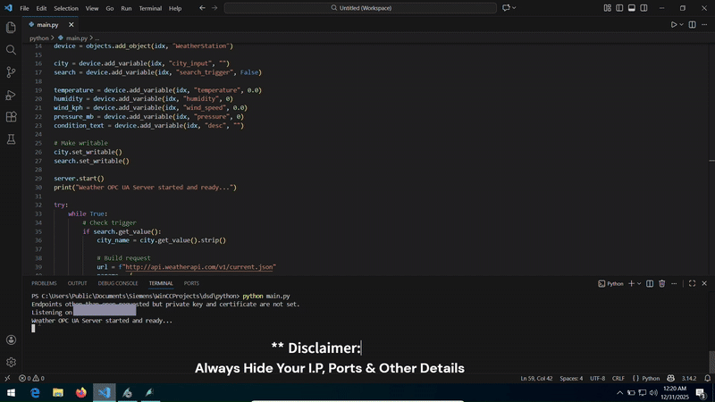

# WinCC OPC UA Python Weather Integration

A lightweight industrial demo showcasing **WinCC SCADA ↔ Python integration using pure OPC UA**.

This project demonstrates how Python can act as a **backend middleware** to fetch live weather data via REST APIs, parse it safely, and update WinCC tags in real time — **without using WinCC REST connectors**.




---

## 📥 Download & Setup

Clone the repository:
```bash
git clone https://github.com/your-username/WinCC_WeatherApp.git
```


<h3> ⚙️Before You Run (Required Updates)</h3>

Before running the project, update the following in the Python code:

1. **OPC UA Endpoint URL**
Update the OPC UA server endpoint to match your WinCC system

```
opc.tcp://<IP_ADDRESS>:<PORT> 
```


2. **Weather API Key**
Replace with your own API key from the https://weatherapi.com
```
"YOUR_API_KEY"
```

3. **OPC UA Node IDs / Tag Names**
Ensure the NodeIds match the OPC UA tags configured in WinCC
